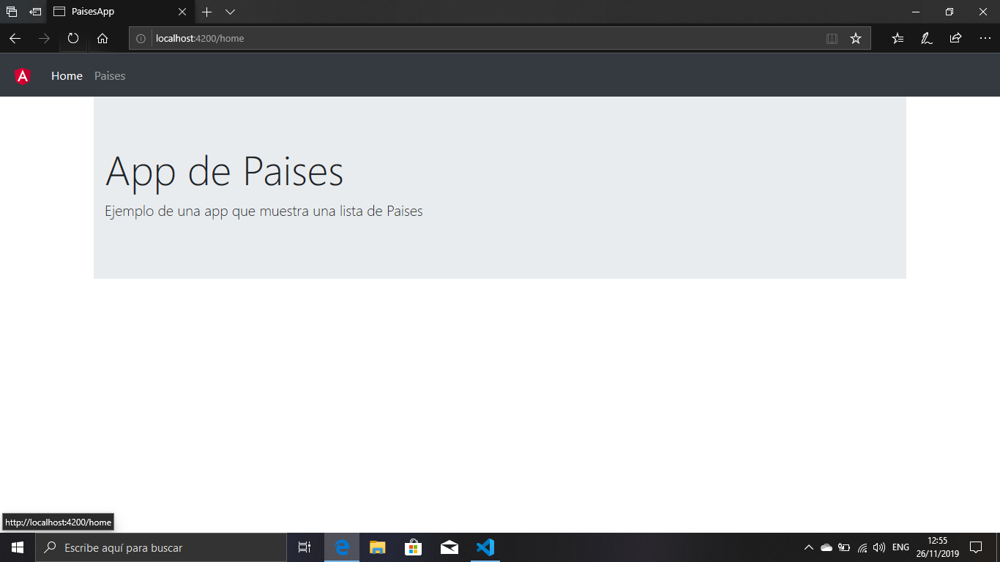

# Proyecto con coneccion a un api
Este es un ejemplo proyecto con node.js en angular. describiremos paso a paso como crear una app sencilla de angular que nos permita un manejo sencillo de datos que se encuentrar en el modulo de services

## 1 - Crear el Proyecto

Crear el proyecto de angular
```bash
ng new PaisesApp
```
si nos pregunta si queres agregar el modulo angular routing le indicamos que si
## 2 - Carpeta del proyecto

Nos transladamos a la carpeta del proyecto que acabos de crear.
```bash
cd PaisesApp
```
## 3 - Boostrap
instalamos en nuestro proyecto boostrap, podemos hacerlo copiando la carpeta de boostrap en una carpeta que creamos llamada /styles y luego creando la referencia en el archivo styles.css
```css
@import './styles/bootstrap-4.3.1-dist/css/bootstrap.min.css';
```
## 4 - Corremos el proyecto 

Corremos el proyecto de angular.
```bash
ng serve -o
```
## 5 - Creamos componentes

Creamos 2 compontes home y lista-paises. Colocamos todos los componentes en la carpeta componentes que se crea automaticamente cuando creamos el primer componente y anteponemos "components/"
```bash
ng g c components/home --spec false
ng g c components/lista-paises --spec false
```
## 5 - Creamos el navbar 

creamos el componente navbar pata poder navegar de una manera mas comoda dentro de la aplicacion.
```bash
ng g c components/shared/navbar --spec false
```
## 6 - Crear interface
creamos el interface con el modelo de datos. 
```bash
ng g i interface/pais 
```
## 7 - Modelo
En la interface de datos creamos nuestro modelo de datos para que pongamos utilizarlo en nuestro proyecto.
```typescript
export interface Pais {
    Nombre:string,
    Capital: string,
    Región : string,
    Subregión:string,
    Población: number,
    Superficie:number,
    Fronteras: Pais[] 
}
```
## 8 - Navbar
agregamos el siguiente codigo al html de navbar
```html
<nav class="navbar navbar-expand-lg navbar-dark bg-dark">
    <a class="navbar-brand" href="#">  </a> <button class="navbar-toggler" 
		type="button" data-toggle="collapse" data-target="#navbarSupportedContent" 
		aria-controls="navbarSupportedContent" aria-expanded="false" aria-label="Toggle navigation"> 
			<span class="navbar-toggler-icon"></span> </button>
    <div class="collapse navbar-collapse" id="navbarSupportedContent">
        <ul class="navbar-nav mr-auto">
            <li class="nav-item" routerLinkActive="active"> <a class="nav-link" [routerLink]="['home']">Home </a> </li>
            <li class="nav-item" routerLinkActive="active"> <a class="nav-link" [routerLink]="['lista-paises']">Paises</a> </li>
        </ul>      
    </div>
</nav>
```
## 9 - Routing
agregamos al archivo del routing las rutas de nuestra app
```typescript
import { NgModule } from '@angular/core';
import { Routes, RouterModule } from '@angular/router';
import { HomeComponent } from './components/home/home.component';
import { ListaPaisesComponent } from './components/lista-paises/lista-paises.component';


const routes: Routes = [
  {path:'home',component:HomeComponent},
  {path:'lista-paises',component:ListaPaisesComponent},
  //comodin
  {path:'**',pathMatch:'full',redirectTo:'hole'}
];

@NgModule({
  imports: [RouterModule.forRoot(routes)],
  exports: [RouterModule]
})
export class AppRoutingModule { }
```
no olvidar importar los componentes

## 11 - Routing en html
agregamos al archivo appcomponent.html la estructura de la ruta
```html
<app-navbar></app-navbar>
<div class="container">
    <!--router-outlet asocia el presente archivo con mi configuración de rutas-->
    <router-outlet></router-outlet>
</div>
```
## 12 - Servicios
creamos un servicio para poder utilizarlo en nuestro proyecto
```bash
ng g s service/intrumentos --spec false
```
## 13 - Assets
copiamos el archivo lista_intrumentos.php en "C:\xampp\htdocs\proyectos" para que podamos acceder a los datos de este archivo y copiamos en la carpeta assets las imagenes del proyecto

## 14 - Datos de la app
agregamos al servicio el metodo para obtener del archivo de php la lista de instrumentos
```typescript
import { Injectable } from '@angular/core';
import { Instrumento } from '../interface/instrumento';
//importamos http client para poder administrar 
import { HttpClient } from '@angular/common/http';
//esto nos sirve para poder mapear el archivo json
import { map } from 'rxjs/operators';

@Injectable({
  providedIn: 'root'
})
export class InstrumentosService {

  private instrumentos: Instrumento[] = [];

  // Inyecta el HttpClient cuando se instancia el servicio
  constructor(private http: HttpClient) {}

  public getInstrumentosFromPhp(){
    console.log('getInstrumentosFromPhp');
    return this.http.get('http//localhost/proyectos/lista_intrumentos.php')
      .pipe(map((InstrumentosServe)=>{
        this.instrumentos = JSON.parse(JSON.stringify(InstrumentosServe));
        console.log(this.instrumentos);
        return this.instrumentos;
      }))
  }
}
```
## 15 - Vista del componente Instrumentos
En el html de intrumentos.html agregamos la tarjeta que por intermedio de un @ngfor utilizaremos para mostrar el conjunto de datos
```html
<h1>Lista de Instrumentos</h1>
<div class="card-columns">
    <div class="card animated fadeIn fast" *ngFor="let instrumentoAux of instrumentos; let i = index">
        
        <div class="card-body">
            <h5 class="card-title">{{instrumentoAux.instrumento}}</h5>
        </div>
    </div>
</div>

```
## 16 - Logica del componente Instrumentos
en el archivo instrumentos.component.ts agregaremos el codigo nesesario y una inyeccion del servicio que nos proveera de los datos y metodos para ser mostrados
```typescript
import { Component, OnInit } from '@angular/core';
import { InstrumentosService } from 'src/app/service/instrumentos.service';
import { Router } from '@angular/router';
import { Instrumento } from 'src/app/interface/instrumento';

@Component({
  selector: 'app-instrumentos',
  templateUrl: './instrumentos.component.html',
  styleUrls: ['./instrumentos.component.css']
})
export class InstrumentosComponent implements OnInit {

  instrumentos : Instrumento[] = [];
  constructor(private _intrumentosService: InstrumentosService, private routed: Router) { }

  ngOnInit() {
     this._intrumentosService.getInstrumentosFromPhp().subscribe(res =>{this.instrumentos = res});
  }
}
```
## 17 - Servicios
agregamos a nuestro archivo app.module.ts el servicio
```typescript
import { BrowserModule } from '@angular/platform-browser';
import { NgModule } from '@angular/core';

import { AppRoutingModule } from './app-routing.module';
import { AppComponent } from './app.component';
import { HomeComponent } from './component/home/home.component';
import { InstrumentosComponent } from './component/instrumentos/instrumentos.component';
import { NavbarComponent } from './component/shared/navbar/navbar.component';
import { InstrumentosService } from './service/instrumentos.service';
import { HttpClientModule } from '@angular/common/http';

@NgModule({
  declarations: [
    AppComponent,
    HomeComponent,
    InstrumentosComponent,
    NavbarComponent
  ],
  imports: [
    BrowserModule,
    //agregamos esto para manejar las solicitudes http
    HttpClientModule,
    AppRoutingModule
  ],
  providers: [InstrumentosService],
  bootstrap: [AppComponent]
})
export class AppModule { }
```

## 18 -  Home
agregamos a home una plantilla de presentacion de nuestra app
```html
<div class="jumbotron jumbotron-fluid">
    <div class="container">
        <h1 class="display-4">App de Instrumentos</h1>
        <p class="lead">Ejemplo de una app que muestra una lista de Instrumentos</p>
    </div>
</div>
```
## 19 - Imagen de navbar
 agregamos a la carpeta assets/img el archivo angular.png

# CAPTURAS

## Home

## Instrumentos


-------------------------------------------------------------------------------------------------------------------------

# INCORPORACION DE DETALLE

## 21 - Creamos el componente de detalles
agregamos un componente de detalles para poder detallar cada instrumento
```bash
ng g c components/detalle --spec false
```
## 22 - Boton Ver Detalle en Componente instrumentos
agregamos en boton de "ver Detalle" a la tarjeta de los instrumentos para que nos conecte con el componente de detalle de cada instrumento
```html
<button (click)="DetalleInstrumento(instrumentoAux.marca)" 
type="button"class="btn btn-outline-primary btn-block">Ver Detalle
</button>
```
## 23 - Metodo en service
agregamos al service el metodo que nos retorna un solo isntrumento de la lista
```typescript
// Busca instrumentos por marca
  public getInstrumentoXMarca(marcaParam: string) {
    for (const inst of this.instrumentos) {
      if (inst.marca === marcaParam) {
        console.log('ENCONTRE ' + inst.instrumento);
        return inst;
      }
    }
  }
```
## 22 - Routing de detalles
agregamos al archivo de routing la pagina de detalles
```typescript
//importamos el componente persona
import { InstrumentoComponent } from './components/instrumento/instrumento.component';
//componente de instrumento asociado a una marca
{ path: 'instrumento/:marca',component:instrumentoComponent},
```
## 23 - Componente de instrumento
agregamos el siguiente codigo a la pagina de instrumento .
``` html
<h1>Detalle del instrumento</h1>
<hr>
<div class="row">
    <div class="col-md-4" style="text-align: center">
         <br><br>
        <a [routerLink]="['/instrumentos']" class="btn btn-outline-danger btn-block">Regresar</a> </div>
    <div class="col-md-8">
        <h3 style="color: crimson">{{instrumento.marca}}</h3>
        <h3 style="color: blue;"> {{instrumento.modelo | uppercase}}</h3>
        <hr>
        <p><b>Descripcion:</b>{{instrumento.descripcion}}</p>
        <p><b>Precio:</b> {{instrumento.precio}}</p>
        <div>  </div>
    </div>
</div>
```

## 24 - Componente Instrumentos
agregamos el metodo al componente de detalle para habilitar el boton de mostrar el quipo
``` typescript
public DetalleInstrumento(ins:string){ this.router.navigate(['/instrumento', ins]) }
```

## 25 - Logica Componente Instrumento
eliminamos el metodo oninit y instanciamos a nuestro service para obtener una instrumento
``` typescript
import { Component, OnInit } from '@angular/core';
import { ActivatedRoute } from '@angular/router';
import { InstrumentosService } from 'src/app/service/instrumentos.service';
import { Instrumento } from 'src/app/interface/instrumento';

@Component({
  selector: 'app-instrumento',
  templateUrl: './instrumento.component.html',
  styleUrls: ['./instrumento.component.css']
})
export class InstrumentoComponent {

  instrumento: Instrumento;

  constructor(private activatedroute: ActivatedRoute, private _instrumentoService: InstrumentosService) {
    this.activatedroute.params.subscribe(params => {
      console.log(params['marca'])
      this.instrumento = _instrumentoService.getInstrumentoXMarca(params['marca']);
    })
  }
}
```
# Captura


-------------------------------------------------------------------------------------------------------------------------
# BUSCADOR
## 26 - Componente buscador
agregamos el componente buscador
``` bash
ng g c component/buscador --spec false
```
## 27 - Boton buscar
agregamos a navbar el codigo html para buscar
```html
 <form class="form-inline my-2 my-lg-0"> <input class="form-control mr-sm-2"
    type="text" placeholder="Buscar Instrumento" #buscarTexto>
    <button (click) = "buscarAndroides(buscarTexto.value)" class="btn btn-outline-success my-2 my-sm-0" 
    type="button">Buscar
    </button> 
 </form>
```
## 28 - Modificar Service
Agregamos el metodo en service para que el componente pueda recibir un termino y asociarlo a un elemento de la coleccion
```typescript
 //buscar instrumentos por el nombre
  public buscarInstrumentos(termino: string):Instrumento[] {
    let instrumentoArr: Instrumento[] = [];
    termino = termino.toLowerCase();
    for(let instrumento of this.instrumentos){
      let ins = instrumento.instrumento.toLowerCase();
      if (ins.indexOf(termino) >= 0) {
        instrumentoArr.push(instrumento);
      }
    }
   return instrumentoArr;
  }
```
## 29 - Logica de Buscador
agregamos el codigo para que podamos asociar al elemento buscador una logica
```typescript
import { Component, OnInit } from '@angular/core';
import { Instrumento } from 'src/app/interface/instrumento';
import { ActivatedRoute, Router } from '@angular/router';
import { InstrumentosService } from 'src/app/service/instrumentos.service';

@Component({
  selector: 'app-buscador',
  templateUrl: './buscador.component.html',
  styleUrls: ['./buscador.component.css']
})
export class BuscadorComponent implements OnInit {

  instrumentos : Instrumento[]=[];
  termino : string;

  constructor(private activatedRoute:ActivatedRoute,private router:Router,private _instrumentoService:InstrumentosService) { }

  ngOnInit() {
    this.activatedRoute.params.subscribe(params =>{
      this.termino = params['termino'];
      this.instrumentos = this._instrumentoService.buscarInstrumentos(params['termino']);
    })
  }

  public DetalleInstrumento(ins:string){ this.router.navigate(['/instrumento', ins]) }
}
```
## - 30 Vista de Buscador
agregamos el codigo a la vista del buscador
``` html
<h1>Buscando: {{termino}} </h1>
<hr>
<div class="row" *ngIf="instrumentos.length == 0">
    <div class="col-md-12">
        <div class="alert alert-info" role="alert"> No existen resultados con el termino: {{termino}} </div>
    </div>
</div>
<div class="card-columns">
    <div class="card animated fadeIn fast" *ngFor="let instrumentoAux of instrumentos; let i = index">
        
        <div class="card-body">
            <h5 class="card-title">{{instrumentoAux.marca}}</h5>
            <p class="card-text">{{instrumentoAux.modelo}}</p>
           <button (click)="DetalleInstrumento(instrumentoAux.marca)" type="button"
            class="btn btn-outline-primary btn-block">Ver Detalle</button>
        </div>
    </div>
</div>
```
## 33 - Modificamos el routing
agregamos al routing del buscador 
```typescript
import { BuscadorComponent } from './components/buscador/buscador.component';
//componente que nos permite buscar por nombre
{ path: 'buscar/:termino', component: BuscadorComponent },
```
## 34 - Modificamos Navbar
modificamos el componente de navbar para habilitar la accion de buscar
``` typescript
import { Component, OnInit } from '@angular/core';
import { Router } from '@angular/router';

@Component({
  selector: 'app-navbar',
  templateUrl: './navbar.component.html',
  styleUrls: ['./navbar.component.css']
})
export class NavbarComponent {

  constructor(private router: Router) { }

  buscarInstrumentos(textoBusqueda: string) {
    this.router.navigate(['/buscar', textoBusqueda]);
  }
}
```
# Captura 
